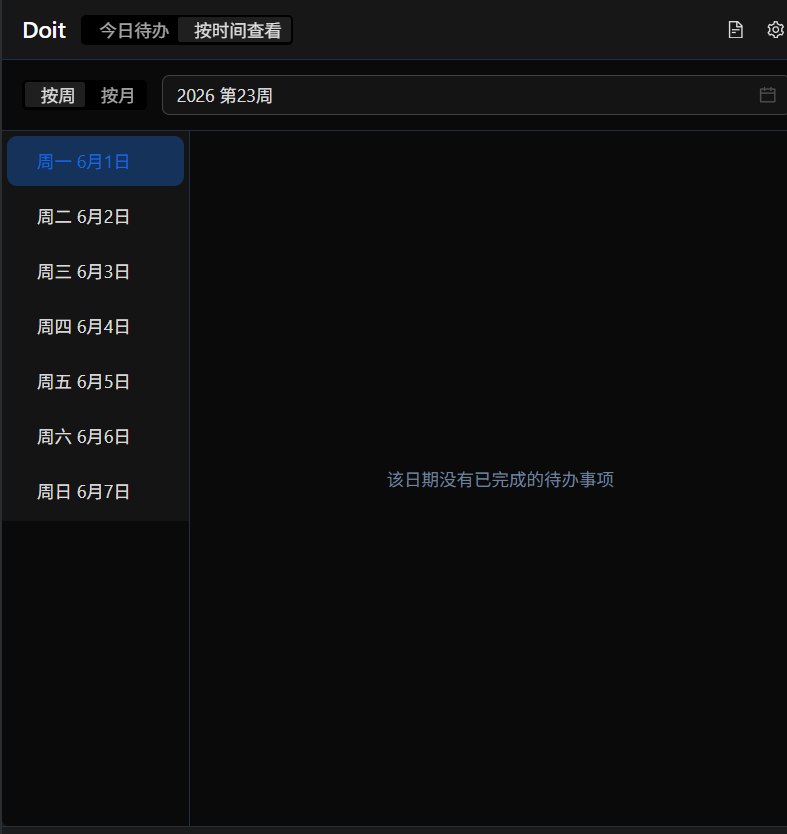
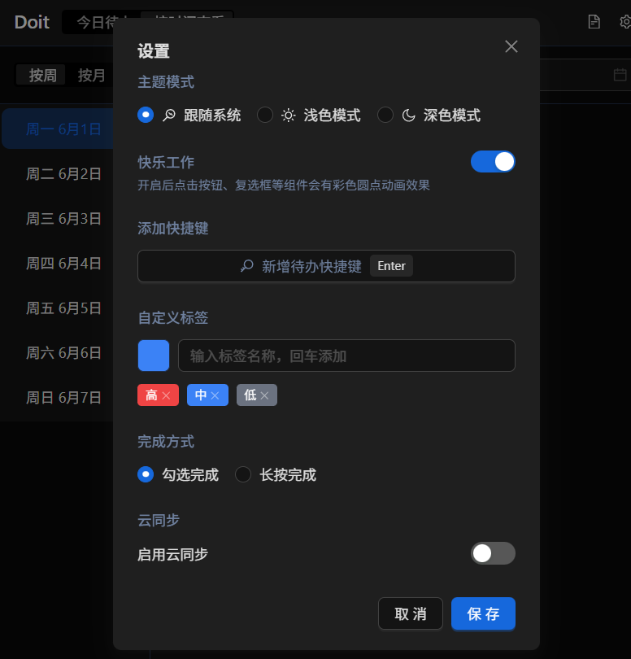
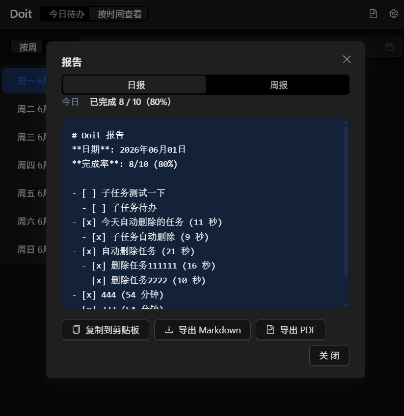

# Doit

极简桌面待办事项应用 — 便签风格，专注高效。

基于 Tauri 2 + Vue 3 + TypeScript 构建，支持 Windows / macOS / Linux。

## 功能

- **待办管理** — 快速新增、勾选完成 / 长按完成、双击编辑、右键菜单操作
- **子任务** — 支持无限层级嵌套子任务，父任务自动同步完成状态
- **拖拽排序** — 拖拽调整顺序，支持跨层级拖拽，FLIP 过渡动画流畅自然
- **标签系统** — 自定义颜色标签，分类管理待办事项
- **日报 / 周报** — 统计完成率、耗时，一键查看
- **多格式导出** — 复制到剪贴板、导出 Markdown、导出 PDF
- **时间视图** — 按周 / 按月查看已完成的待办事项
- **深色模式** — 跟随系统 / 浅色 / 深色，自动切换
- **快乐工作模式** — 操作时带有彩色圆点动画效果
- **自定义快捷键** — 可自定义新增待办的快捷键
- **云同步** — 支持 WebDAV 和本地文件夹同步
- **本地存储** — SQLite 存储（Tauri 桌面环境），浏览器降级 localStorage

## 截图

<p align="center">
  
  
</p>
<p align="center">
  
  
</p>

## 下载

前往 [Releases](https://github.com/nabaonan/doit/releases) 页面下载对应平台的安装包：

| 平台 | 格式 |
|---|---|
| Windows | `.msi` / `.exe` |
| macOS (Intel) | `.dmg` |
| macOS (Apple Silicon) | `.dmg` |
| Linux | `.deb` / `.AppImage` |

## 开发

### 环境要求

- [Node.js](https://nodejs.org/) >= 18
- [Rust](https://www.rust-lang.org/)（Tauri 桌面开发需要）

### 启动

```bash
# 安装依赖
npm install

# 浏览器开发模式（热更新调试）
npm run dev

# Tauri 桌面开发模式
npm run tauri dev
```

### 构建

```bash
# 前端类型检查 + 构建
npm run build

# Tauri 桌面打包
npm run tauri build
```

### 发版

```bash
npm run release
```

自动 bump 版本号、同步 Tauri 配置、提交、打 tag 并推送，触发 CI 多平台构建发布。

## 技术栈

| 类别 | 技术 |
|---|---|
| 桌面壳 | Tauri 2 (Rust, Edition 2021) |
| 前端框架 | Vue 3.5 Composition API (`<script setup>`) |
| 类型系统 | TypeScript 5.9 strict |
| 构建工具 | Vite 8 + Rolldown |
| 样式方案 | Tailwind CSS 4 + shadcn-vue / radix-vue 设计令牌 |
| UI 组件库 | antdv-next (Ant Design Vue) |
| 拖拽 | vuedraggable (SortableJS Vue 3 封装) |
| 图标 | @antdv-next/icons |
| 日期处理 | dayjs + isoWeek 插件 |
| PDF 导出 | jsPDF |
| 存储 | SQLite（Tauri 插件）+ localStorage 浏览器降级 |

## 项目结构

```
src/
├── types/index.ts           # 数据模型 (TodoItem, AppSettings, Tag, ShortcutConfig)
├── services/
│   ├── tauriEnv.ts          # isTauri 环境检测
│   ├── todoService.ts       # 待办 CRUD（SQLite / localStorage 双模式）
│   └── settingsService.ts   # 设置读写（SQLite / localStorage 双模式）
├── components/
│   ├── TitleBar.vue         # 顶部栏：视图切换、报告、设置入口
│   ├── TodoItem.vue         # 单条目：勾选 / 长按完成、双击编辑、右键菜单、标签
│   ├── NestedTodoList.vue   # 递归嵌套列表：支持无限层级子任务拖拽
│   ├── TimeView.vue         # 时间视图：按周 / 按月查看已完成事项
│   ├── SettingsDialog.vue   # 设置弹窗：主题、快捷键、标签、完成方式、云同步
│   └── ReportDialog.vue     # 报告弹窗：日报 / 周报统计、导出
├── App.vue                  # 状态持有者 + 事件协调（唯一数据源）
├── main.ts                  # 入口：注册 antdv-next 全局组件
└── style.css                # 全局样式：Tailwind、CSS 变量、滚动条
```

## 数据流

```
TodoItem ─emit─→ NestedTodoList ─emit─→ App.vue ─调用─→ Service ──→ Storage
                     ↑
            const todos = ref<TodoItem[]>([])
            修改 ref → 自动重渲染所有子组件
```

- **App.vue** 持有所有状态（`todos`、`settings`），是唯一的 "single source of truth"
- 子组件通过 `defineEmits<T>()` 上报事件，不跨层
- 拖拽时维护本地副本，通过 `watch` 与 props 同步并执行 FLIP 动画

## License

MIT
